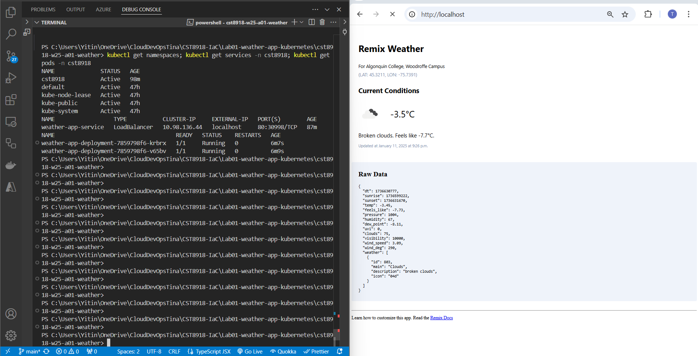

CST8918 - DevOps: Infrastructure as Code  

# LAB-A01 Weather App

In this lab, I integrated a Node.js-based web application with the OpenWeather API to display current weather conditions. The project emphasized containerization and Kubernetes deployment practices, including:

- Creating Kubernetes deployment, namespace, service YAML manifests for deployment, service, and namespace.
- Configuring secrets to securely store and access the OpenWeather API key.
- Building, pushing, and deploying the application using Docker and Kubernetes.
- Troubleshooting deployment and API connectivity issues.

This project served as a hands-on introduction to Kubernetes concepts and practical containerized application deployment.

